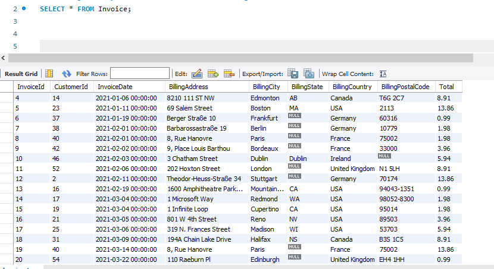
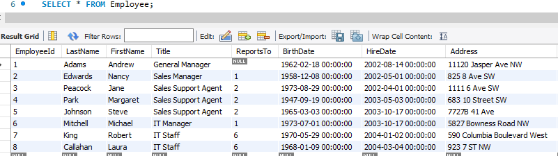
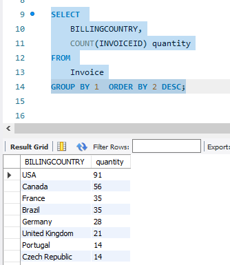
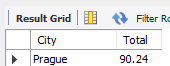
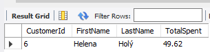
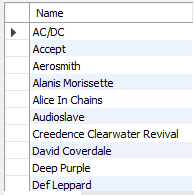
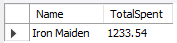
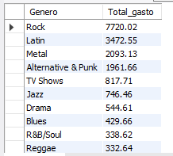
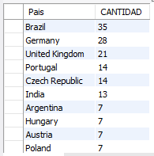
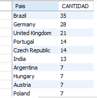

1.  Ejecutar y revisar el resultado de las siguientes consultas: 
    ```sql
    -- Consulta Factura
    SELECT * FROM Invoice;
    ```

    

     ```sql
    -- Consultat Empleados
    SELECT * FROM Employee;
    ```
    

     ```sql
    -- Consulta Pais y Factura
    SELECT 
        BILLINGCOUNTRY,
        COUNT(INVOICEID) quantity
    FROM 
        Invoice
    GROUP BY 1  ORDER BY 2 DESC;
    ```

    

2.	¿Qué país tiene más facturas?
    
    Pais con mayor factura **USA**

3.	Se quiere promocionar un nuevo festival musical, para ello es necesario  saber en qué ciudad  hay mas facturas (invoices). Determinar en qué ciudad la suma de facturas es la mayor.
    ```sql
    -- Consultar Suma de Facturas por ciudad
    SELECT 
        BillingCity City,
        sum(Total) Total
    FROM 
        Invoice
    GROUP BY 1  ORDER BY 2 DESC;

        -- La ciudad con mayor factura es Prague
    ```
    

4.	Determinar quien es el mejor cliente (el que mas ha gastado en el sistema)
CON AYUDA DE CHAT GPT:

    ```sql
    -- Consultar Suma de Facturas por ciudad
    SELECT
        Customer.CustomerId, 
        Customer.FirstName,
        Customer.LastName,
        SUM(Total) AS TotalSpent
    FROM Invoice
    JOIN Customer ON Invoice.CustomerId = Customer.CustomerId
    GROUP BY Customer.CustomerId
    ORDER BY TotalSpent DESC
    LIMIT 1;
    ```

    

5.	Obtener una tabla con el correo, nombre y apellido de todos las personas que escuchan Rock. Retornar la lista por orden alfabético
    ```sql
    SELECT
        distinct c.Email,
        concat_ws(' ', c.LastName, FirstName)Names
    FROM
        Customer c
        INNER JOIN Invoice 	i      ON(i.CustomerId = c.CustomerId)
        INNER JOIN InvoiceLine 	il ON(il.InvoiceId = i.InvoiceId)
        INNER JOIN Track t         ON(t.TrackId = il.TrackId)
        INNER JOIN Genre g 		   ON(g.GenreId = t.GenreId)
    WHERE
        g.Name = 'Rock'
    order by 2 asc;
    ```

    

6.	Sacar una lista con todos los artistas que generan música rock

    ```sql
    SELECT
        distinct c.Name
    FROM
        Artist c
        INNER JOIN Album a ON(a.ArtistId = c.ArtistId)
        INNER JOIN Track t ON(t.AlbumId = a.AlbumId)
        INNER JOIN Genre g ON(g.GenreId = t.GenreId)
    WHERE
        g.Name = 'Rock'
    order by 1 asc;
    ```

    

7.	Encontrar cual es el artista que más ha ganado de acuerdo al campo invoiceLines.

    ```sql
    SELECT
        c.Name,
        SUM(Total) AS TotalSpent
    FROM
        Artist c
        INNER JOIN Album a ON(a.ArtistId = c.ArtistId)
        INNER JOIN Track t ON(t.AlbumId = a.AlbumId)
        INNER JOIN Genre g ON(g.GenreId = t.GenreId)
        INNER JOIN InvoiceLine 	il ON(il.TrackId = t.TrackId)
        INNER JOIN Invoice 	i      ON(il.InvoiceId = i.InvoiceId)
    GROUP BY c.Name
    ORDER BY 2 DESC
    LIMIT 1;
    ```

    

8.	Encontrar cuanto gastaron en total en estados unidos en compras

    ```sql
    SELECT 
        BILLINGCOUNTRY,
        sum(Total) Total_gasto
    FROM 
        Invoice
    WHERE
        BILLINGCOUNTRY='Usa';
    ```

    

9.	Encontrar cuánto gastaron los usuarios por género.

    ```sql
    SELECT
        g.Name Genero,
        SUM(Total) AS Total_gasto
    FROM
        Track t 
        INNER JOIN Genre g ON(g.GenreId = t.GenreId)
        INNER JOIN InvoiceLine 	il ON(il.TrackId = t.TrackId)
        INNER JOIN Invoice 	i      ON(il.InvoiceId = i.InvoiceId)
    GROUP BY g.GenreId
    ORDER BY 2 DESC;
    ```

    

10.	Generar una tabla con el conteo de usuarios por cada país.

    ```sql
    SELECT
        i.BillingCountry Pais,
        COUNT(*) CANTIDAD
    FROM
        Customer c
        INNER JOIN Invoice 	i      ON(i.CustomerId = c.CustomerId)
    GROUP BY i.BillingCountry
    order by 2 DESC;
    ```

    

11.	Encontrar cuantas canciones hay por cada género.

    ```sql
    SELECT
        i.BillingCountry Pais,
        COUNT(*) CANTIDAD
    FROM
        Customer c
        INNER JOIN Invoice 	i      ON(i.CustomerId = c.CustomerId)
    GROUP BY i.BillingCountry
    order by 2 DESC;
    ```

    
